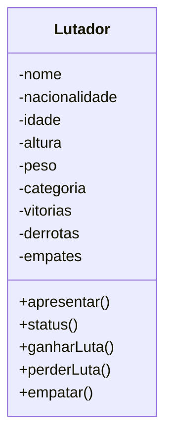
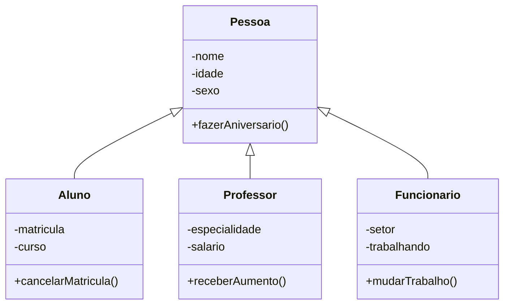
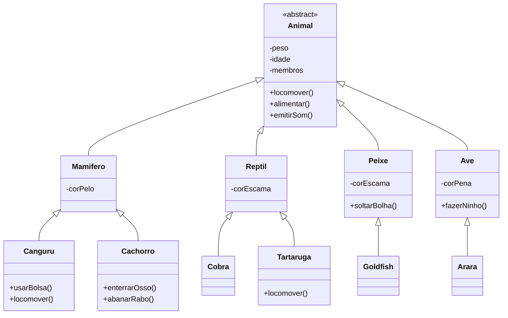
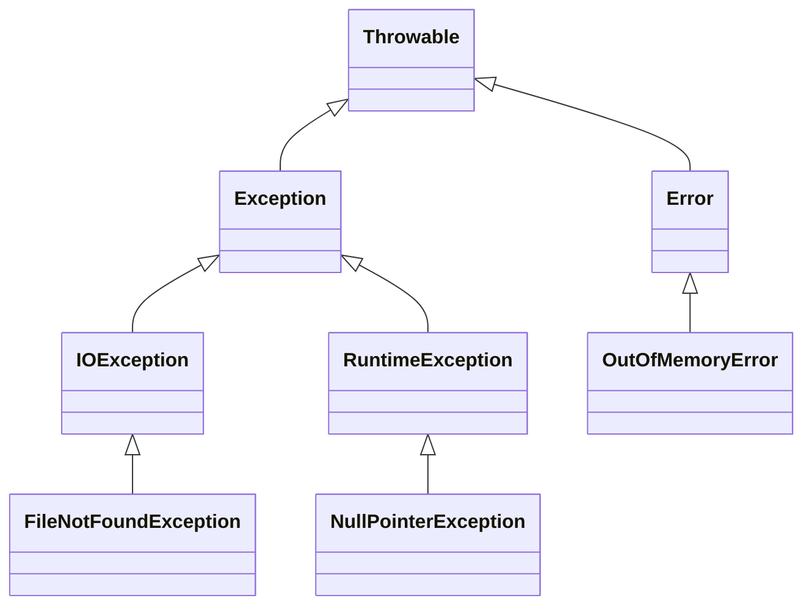

# Programação Orientada a Objetos (POO)

**Objetivo:** Aproximar o mundo digital do mundo real.

---

## Linha do Tempo da Programação

```
Programação Baixo Nível → Programação Linear → Programação Estruturada → Programação Modular → Programação Orientada a Objetos
```

---

## Vantagens da POO

- **Confiável:** Isolamento gera softwares mais seguros.
- **Oportuno:** Permite o desenvolvimento paralelo.
- **Manutenível:** Facilita atualizações no sistema.
- **Extensível:** Facilita o crescimento do software.
- **Reutilizável:** Objetos podem ser reaproveitados em outros sistemas.
- **Natural:** O foco na funcionalidade aproxima o sistema do mundo real.

---

# O que é um Objeto?

Um objeto é uma representação de uma coisa material ou abstrata, descrita por seus **atributos** (características), **métodos** (ações) e **estado** (condição atual).

Exemplo: **Caneta**

| Elemento | Descrição |
|:--------|:----------|
| Atributos | Modelo, Cor, Ponta, Carga, Tampada |
| Métodos  | Escrever, Desenhar, Tampar, Destampar |
| Estado   | Tampada, Destampada, Com carga, Sem carga |

---

# O que é uma Classe?

Uma **classe** é um molde usado para criar objetos. Ela define os atributos e métodos comuns a todos os objetos daquele tipo.

Exemplo de classe:

```pseudo
Classe Caneta
    modelo: Caractere
    cor: Caractere
    ponta: Real
    carga: Inteiro
    tampada: Lógico
    
    Método rabiscar()
        Se (tampada) então
            Escreva("ERRO: Caneta tampada!")
        Senão
            Escreva("Rabiscando...")
        FimSe
    FimMetodo

    Método tampar()
        tampada = verdadeiro
    FimMetodo

    Método destampar()
        tampada = falso
    FimMetodo
FimClasse
```

---

# Instanciando Objetos

```pseudo
c1 = nova Caneta
c1.cor = "Azul"
c1.ponta = 0.5
c1.tampada = falso
c1.rabiscar()

c2 = nova Caneta
c2.cor = "Vermelha"
c2.ponta = 1.0
c2.tampar()
```

---

# Diferença entre Classe e Objeto

| Termo | Definição |
|:------|:----------|
| Classe | Molde que define atributos e métodos. |
| Objeto | Instância da classe criada em tempo de execução. |

---

# Visibilidade dos Atributos e Métodos

## Modificadores de Visibilidade

- **public (+):** Acesso livre de qualquer lugar.
- **private (-):** Acesso restrito à própria classe.
- **protected (#):** Acesso pela própria classe e por suas subclasses.

Exemplo:

```pseudo
Classe Caneta
    publico modelo: Caractere
    publico cor: Caractere
    privado ponta: Real
    protegido carga: Inteiro
    protegido tampada: Lógico

    privado Metodo tampar()
    FimMetodo
    
    publico Metodo rabiscar()
    FimMetodo
FimClasse
```

---

# Métodos Especiais: Getters e Setters

- **Getters:** Recuperam valores de atributos privados.
- **Setters:** Alteram valores de atributos privados.

```pseudo
Classe Caneta
    public modelo: Caractere
    private ponta: Real

    public Metodo getModelo()
        return modelo
    FimMetodo

    public Metodo setModelo(m: Caractere)
        modelo = m
    FimMetodo

    public Metodo getPonta()
        return ponta
    FimMetodo

    public Metodo setPonta(p: Real)
        ponta = p
    FimMetodo
FimClasse
```

---

# Método Construtor

**O que é?**  
O **método construtor** é um método especial usado para inicializar um objeto assim que ele é criado. Ele configura os valores iniciais dos atributos e pode executar outras ações de preparação.

Exemplo:

```pseudo
Classe Caneta
    Metodo construtor(m: Caractere, c: Caractere, p: Real)
        setModelo(m)
        setCor(c)
        setPonta(p)
        tampar()
    FimMetodo
FimClasse

c1 = nova Caneta("BIC", "Azul", 0.5)
```

---

# Pilares da POO

- **Encapsulamento**
- **Herança**
- **Polimorfismo**

---

# Encapsulamento

Ocultar detalhes internos de implementação e expor apenas o que é necessário para o uso do objeto.

---

# Interface

**O que é?**  
Uma **interface** define um conjunto de métodos que uma classe deve implementar. Ela estabelece um "contrato" de comportamento, mas não diz como os métodos serão realizados.

Exemplo de Interface:

```pseudo
interface Controlador
    public abstrato Metodo ligar()
    public abstrato Metodo desligar()
    public abstrato Metodo abrirMenu()
    public abstrato Metodo fecharMenu()
    public abstrato Metodo maisVolume()
    public abstrato Metodo menosVolume()
    public abstrato Metodo ligarMudo()
    public abstrato Metodo desligarMudo()
    public abstrato Metodo play()
    public abstrato Metodo pause()
FimInterface
```

Classe que implementa a Interface:

```pseudo
classe ControleRemoto
    implementa Controlador

    private inteiro volume
    private logico ligado
    private logico tocando

    public Metodo ligar()
        setLigado(verdadeiro)
    FimMetodo

    public Metodo desligar()
        setLigado(falso)
    FimMetodo

    ...
FimClasse
```

---

# Relacionamento entre Classes




---

# Herança

Permite criar novas classes que herdam atributos e métodos de uma classe existente.

Exemplo:



### Tipos de Herança

- **Herança de Implementação:** Copia atributos e métodos da superclasse.
- **Herança por Diferença:** Além de herdar, adiciona ou altera funcionalidades.

---

# Abstração e Herança

| Conceito | Descrição |
|:---------|:----------|
| Classe Abstrata | Classe que não pode ser instanciada. |
| Método Abstrato | Método sem implementação na classe mãe. |
| Classe Final | Classe que não pode ser herdada. |
| Método Final | Método que não pode ser sobrescrito. |

---

# Polimorfismo

Permite que métodos com o mesmo nome atuem de maneiras diferentes, dependendo do objeto que os chama.

- Assinatura do método quantidade e os tipos dos parâmetros.
```
publico método calcMedia(n1: Real, n2: Real): Real
```
```
publico método calcMedia(v1: Real, v2: Real): Inteiro
```


### Tipos de Polimorfismo
- Sobreposição: acontece quando **substituímos** um método de uma superclasse, usando a **mesma assinatura.**




```pseudo
classe abstrata Animal
  protegido peso: Real
  protegido idade: Real
  protegido membros: Real
  publico método abstrata locomover()
  publico método abstrata alimentar()
  publico método abstrata emitirSom()
FimClasse
```

```pseudo
Classe Mamifero estende Animal
  privado corPelo: Carcatere
  @Sobrepor
  publico método locomover()
	Escreva("Correndo")
  fimMetodo
  @Sobrepor
  publico método alimentar()
	Escreva("Mamando")
  fimMetodo
  @Sobrepor
  publico método emitirSom()
	Escreva("Som de mamifero")
  fimMetodo
FimClasse
```

```pseudo
Classe Reptil estende Animal
  privado corEscama: Carcatere
  @Sobrepor
  publico método locomover()
	Escreva("Rastejando")
  fimMetodo
  @Sobrepor
  publico método alimentar()
	Escreva("Comendo insetos")
  fimMetodo
  @Sobrepor
  publico método emitirSom()
	Escreva("Som de reptil")
  fimMetodo
FimClasse
```

```pseudo
Classe Peixe estende Animal
  privado corEscama: Carcatere
  @Sobrepor
  publico método locomover()
	Escreva("Nadando")
  fimMetodo
  @Sobrepor
  publico método alimentar()
	Escreva("Comendo algas")
  fimMetodo
  @Sobrepor
  publico método emitirSom()
	Escreva("Peixe não faz som")
  fimMetodo
publico método soltarBolha()
	Escreva("Soltou uma bolha")
  fimMetodo
FimClasse
```
```pseudo
Classe Ave estende Animal
  privado corPena: Carcatere
  @Sobrepor
  publico método locomover()
	Escreva("Voando")
  fimMetodo
  @Sobrepor
  publico método alimentar()
	Escreva("Comendo frutas")
  fimMetodo
  @Sobrepor
  publico método emitirSom()
	Escreva("Som de pássaros")
  fimMetodo
publico método fazerNinho()
	Escreva("Fazendo ninho")
  fimMetodo
FimClasse
```

```pseudo
Classe Canguru estende Mamifero
   publico metodo usarBolsa()
	Escreva("Usando bolsa")
  fimMetodo
  @Sobrepor
  publico método locomover()
	Escreva("Saltando")
  fimMetodo
FimClasse
```

```pseudo
Classe Cachorro estende Mamifero
   publico metodo enterrarOsso()
	Escreva("Enterrando osso")
  fimMetodo
  publico metodo abanarRabo()
	Escreva("Abanando o rabo")
  fimMetodo
  @Sobrepor
  publico método emitirSom()
	Escreva("Latindo")
  fimMetodo
FimClasse
```

```pseudo
Classe Cobra estende Réptil

FimClasse
``` 

```pseudo
Classe Tartaruga estende Reptil
  @Sobrepor
  publico método locomover()
	Escreva("Andando beeem devagar")
  fimMetodo
FimClasse
```

```pseudo
Classe GoldFish estende Peixe

FimClasse
```

```pseudo
Classe Arara estende Ave

FimClasse
```

```
// Programa Principal

m = novo Mamifero()
c = novo Canguru()
k = novo Cachorro()

m.setPeso(5.70)
m.setIdade(8)
m.setMembros(4)
m.locomover() // Correndo
m.alimentar() // Mamando
m.emitirSom() // Som de Mamífero

c.setPeso(55.30)
c.setIdade(3)
c.setMembros(4)
c.locomover() // Saltando
c.alimentar() // Mamando
c.emitirSom() // Som de Mamífero
c.usarBolsa()

k.setPeso(3.94)
k.setIdade(5)
k.setMembros(4)
k.locomover() // Correndo
k.alimentar() // Mamando
k.emitirSom() // Som de Mamífero
k.abanarRabo()

```
- Sobrecarga: assinaturas diferentes, mesma classe.

```
classe Cachorro estende lobo
	publico método reagir(frase: Caractere)
		se (frase="toma comida" ou frase="Olá")
			escreva("Abanar e Latir")
		senão
			escreva("Rosnar")
		fimSe
	fimMetodo
	publico método reagir(hora, min: Inteiro)
		se(hora<12)
			escreva("Abanar")
		senaoSe (hora>=18)
			escreva("Ignorar")
		senão
			escreva("Abanar e Latir")
		fimSe

	fimMetodo
	publico método reagir(dono: Logico)
		se(dono = verdadeiro)
			escreva("Abanar")
		senão
			escreva("Rosnar e Latir")
		fimSe
	fimMetodo
	publico método reagir(idade: Inteiro, pessoa: Real)
		se(idade<5)
			se(peso<10)
				escreva("Abanar")
			senão
				escreva("Latir")
			fimSe
		senão
			se(peso<10)
				escreva("Rosnar")
			senão
				escreva("Ignorar")
			fimSe
		fimSe
	fimMetodo
FimClasse


//Programa Principal 

c = novo Cachorro()

c.reagir("Olá")
c.reagir("Agora não")
c.reagir(11, 45)
c.reagir(21, 00)
c.reagir(verdadeiro)
c.reagir(falso)
c.reagir(2, 12.5)
c.reagir(17, 4.5)

```

### Anotações extras

- Método Format
```java
String nome = "Maria";
int idade = 30;
double valor = 55.9999;
System.out.println(String.format("Meu nome é %s, eu tenho %d anos e hoje gastei %.2f reais", nome, idade, valor));
```

```java
String nome = "João";
int aulas = 4;

String mensagem = """
                  Olá, %s!
                  Boas vindas ao curso de Java.
                  Teremos %d aulas para te mostrar o que é preciso para você dar o seu primeiro mergulho na linguagem!
                  """.formatted(nome, aulas);

System.out.println(mensagem);
```

- Casting (explícito)
```java
	int classificacao = (int) (media /2) ;
	System.out.println(classificacao);
```

- Casting (implícito)
  ```java
	int x = 10;
	double y = x; // casting implícito
  ```

  * Scanner
  ```java
  public class ExemploScanner {
    public static void main(String[] args) {
        Scanner scanner = new Scanner(System.in);

        System.out.print("Digite seu nome: ");
        String nome = scanner.nextLine();
        System.out.print("Digite sua idade: ");
        int idade = scanner.nextInt();
        System.out.print("Digite o valor que pretende investir esse mês: ");
        double valor = scanner.nextDouble();

        System.out.println(nome + " que tem " + idade + " anos, irá investir R$ "+ valor + " esse mês.");

        scanner.close();
    }
}
```


### ✅ O que é o método `toString()`?

O método `toString()` é usado para **representar um objeto como texto**. Ele é definido na classe `Object` (a superclasse de todas as classes em Java), e por padrão retorna algo como:

```
NomeDaClasse@códigoHexadecimal
```

---

### 🔧 Por que sobrescrever?

Ao sobrescrever o método `toString()`, você pode **exibir informações úteis** sobre o objeto, como atributos, ao invés de um código confuso.

---

### 🧩 Exemplo prático:

```java
public class Filme {
    private String nome;
    private int ano;

    public Filme(String nome, int ano) {
        this.nome = nome;
        this.ano = ano;
    }

    @Override
    public String toString() {
        return "Filme: " + nome + " (" + ano + ")";
    }
}
```

Uso:

```java
Filme filme = new Filme("Matrix", 1999);
System.out.println(filme);
```

🔸 **Saída:**

```
Filme: Matrix (1999)
```

---

- forEach

```java
ArrayList<String> nomes = new ArrayList<>();
nomes.add("Jacqueline");
nomes.add("Paulo");
nomes.add("Suellen");
nomes.add("Emily");

for (String nome : nomes) {
    System.out.println(nome);
}
```

```java
nomes.forEach(nome -> System.out.println(nome));
```

```java
nomes.forEach(System.out::println);
```

---

### 🧠 O que é a interface Comparable?
Comparable é uma interface usada para definir uma ordem natural de objetos.

Ela serve para dizer: "Como essa classe sabe se um objeto é maior, menor ou igual a outro objeto da mesma classe?"

Com isso, você pode usar diretamente métodos como Collections.sort(lista) ou lista.sort(...) sem precisar criar um comparador externo.

#### 🧪 Como usar a interface Comparable em uma classe
Vamos supor que você tenha uma classe chamada Pessoa com nome e idade, e você quer ordenar uma lista de pessoas pela idade.

- Passo a passo:
A classe implementa Comparable<T>, onde T é o nome da própria classe.

Você implementa o método compareTo(), que define como comparar dois objetos.

💻 Exemplo completo:
```
import java.util.*;

public class Pessoa implements Comparable<Pessoa> {
    private String nome;
    private int idade;

    public Pessoa(String nome, int idade) {
        this.nome = nome;
        this.idade = idade;
    }

    public String getNome() {
        return nome;
    }

    public int getIdade() {
        return idade;
    }

    // Implementação do método compareTo
    @Override
    public int compareTo(Pessoa outra) {
        // Ordena por idade (ordem crescente)
        return Integer.compare(this.idade, outra.idade);
    }

    @Override
    public String toString() {
        return nome + " (" + idade + " anos)";
    }

    // Classe principal para testar
    public static void main(String[] args) {
        List<Pessoa> pessoas = new ArrayList<>();
        pessoas.add(new Pessoa("Clara", 22));
        pessoas.add(new Pessoa("João", 19));
        pessoas.add(new Pessoa("Marina", 25));

        System.out.println("Antes da ordenação:");
        for (Pessoa p : pessoas) {
            System.out.println(p);
        }

        // Ordena com base no compareTo (idade)
        Collections.sort(pessoas);

        System.out.println("\nDepois da ordenação por idade:");
        for (Pessoa p : pessoas) {
            System.out.println(p);
        }
    }
}
```
#### 📊 O que faz o compareTo()?

```
public int compareTo(Pessoa outra) {
    return Integer.compare(this.idade, outra.idade);
}

```
Isso compara a idade da pessoa atual (this) com a idade da outra pessoa (outra):

- Retorna negativo → this é menor que outra

- Retorna zero → são iguais

- Retorna positivo → this é maior que outra

#### ✅ Quando usar Comparable?
Use Comparable quando:

- Você quer definir uma ordem "padrão" para objetos da sua classe.

- Vai usar Collections.sort(lista) ou lista.sort(null).

Se quiser ordenar de vários jeitos diferentes, aí é melhor usar a interface Comparator.

### 🧠 O que é o Comparator?
O Comparator é uma interface funcional do Java usada para dizer como dois objetos devem ser comparados. Ele é muito usado quando você quer ordenar uma lista de um jeito específico, por exemplo:

- Por ordem alfabética

- Por idade

- Por tamanho

- Por número (crescente ou decrescente)

### 🔧 O que é o Comparator.comparing()?
O método Comparator.comparing() é uma forma prática e moderna (desde o Java 8) de criar um comparador automaticamente a partir de algum atributo do objeto.

Exemplo:

```
Comparator.comparing(Pessoa::getIdade)
```
Isso cria um comparador que ordena pessoas pela idade.

### Listas em Java: Principais Classes

No Java, existem várias classes para representar listas de elementos, cada uma com características específicas:

#### **ArrayList**

O `ArrayList` é baseado em um **array dinâmico**. Ele ajusta automaticamente seu tamanho ao adicionar ou remover elementos. É muito usado por ser simples e eficiente, especialmente quando se precisa acessar elementos rapidamente por índice.

#### **LinkedList**

O `LinkedList` é uma **lista encadeada**, onde cada elemento aponta para o próximo. Ele permite **inserções e remoções eficientes** em qualquer posição da lista, mas é **menos eficiente para buscas** diretas, já que não usa índices como o `ArrayList`.


#### 🔹 **Vector**

A classe `Vector` é parecida com o `ArrayList` porque também usa um **array dinâmico** para armazenar os elementos. A grande diferença entre eles é que o `Vector` é **sincronizado**, enquanto o `ArrayList` não é.

##### ✅ **O que significa sincronizado?**

Em programação, **sincronização** significa que **apenas uma thread pode acessar o `Vector` por vez** quando está lendo ou alterando os dados. Isso evita **problemas de concorrência**, como duas threads tentando adicionar ou remover elementos ao mesmo tempo, o que poderia corromper os dados.

###### 🧵 O que são *threads*?

Threads são como "tarefas paralelas" que um programa pode executar ao mesmo tempo. Por exemplo, em um app, uma thread pode estar baixando dados da internet enquanto outra atualiza a interface gráfica. Se duas threads acessam a mesma lista ao mesmo tempo **sem sincronização**, pode haver conflitos ou erros (como tentar ler um valor que ainda está sendo modificado).

##### 🛡️ Como o `Vector` resolve isso?

O `Vector` usa **métodos sincronizados**, ou seja, **ele trava o acesso à lista quando uma thread está usando**, e só libera quando terminar. Isso **garante segurança** em ambientes com várias threads, mas também **deixa o acesso mais lento**, porque outras threads precisam esperar.

##### ⚖️ Quando usar `Vector`?

* Quando **várias threads vão acessar/modificar** a mesma lista ao mesmo tempo.
* Se você **não precisa de múltiplas threads**, o `ArrayList` é mais rápido e recomendado.

---

#### **Stack**

A classe `Stack` implementa a estrutura de **pilha**, que segue o princípio **LIFO** ("last-in, first-out"). Ou seja, o último elemento adicionado é o primeiro a ser removido. É útil em algoritmos como análise de expressões, chamadas de função e navegação entre páginas.

---

### ✅ **O que é o `Map`?**

O `Map` é **um tipo genérico (interface)** no Java. Ele **define como deve ser uma estrutura que guarda pares de chave e valor**, mas **não diz como isso será feito na prática**.

Você pode pensar no `Map` como uma **ideia ou modelo**. Ele diz:

> "Você deve permitir associar chaves a valores, buscar um valor por uma chave, remover pares, etc."

Mas **ele não funciona sozinho** — alguém precisa implementar esse modelo.

---

### ✅ **O que é o `HashMap`?**

O `HashMap` é **uma classe concreta** que **implementa o modelo do `Map`**. Ou seja, o `HashMap` **usa a ideia do Map e coloca isso para funcionar de verdade**.

Ele guarda os pares de chave e valor em uma estrutura interna chamada **tabela hash**, que permite **acessos muito rápidos**.

---

### 🧠 **Fazendo uma analogia simples:**

Imagine que o `Map` é **um contrato para fazer uma estante com gavetas nomeadas** (cada gaveta tem um nome = chave, e guarda algo dentro = valor).

* O `Map` só define como essa estante deve funcionar: "cada gaveta deve ter um nome, você pode colocar coisas, tirar coisas, ver o que tem..."
* O `HashMap` é **uma versão concreta** dessa estante, construída usando um sistema chamado **tabela hash** que organiza tudo de forma super rápida.

---

### ⚖️ **Resumo da diferença:**

| `Map`                                                                              | `HashMap`                                      |
| ---------------------------------------------------------------------------------- | ---------------------------------------------- |
| É uma **interface** (modelo)                                                       | É uma **classe** (implementação real)          |
| Define o que um mapa deve fazer                                                    | Implementa o que o Map faz, usando tabela hash |
| Não pode ser usado diretamente                                                     | Pode ser usado para criar objetos de verdade   |
| Existem várias implementações de `Map`, como `HashMap`, `TreeMap`, `LinkedHashMap` | `HashMap` é a mais usada, rápida e prática     |

---

### 💻 Exemplo:

```java
// Usando a interface Map com a classe HashMap
Map<String, Integer> mapa = new HashMap<>();

mapa.put("Maçã", 10);
mapa.put("Banana", 5);

// Aqui estamos usando a ideia de Map, mas com a funcionalidade do HashMap
System.out.println(mapa.get("Maçã")); // Saída: 10
```
---

### Conexão com API (exemplo

```java
Scanner sc = new Scanner(System.in);
        System.out.println("O que você deseja assistir? ");
        var busca = sc.nextLine();

        String endereco = "https://www.omdbapi.com/?t=" + busca + "&apikey=xxxxx";


        HttpClient client = HttpClient.newHttpClient();
        HttpRequest request = HttpRequest.newBuilder()
                .uri(URI.create(endereco))
                .build();

        HttpResponse<String> response = client
                .send(request, HttpResponse.BodyHandlers.ofString());
        System.out.println(response.body());

```

Claro! Aqui está um resumo em Markdown com um diagrama Mermaid explicando a hierarquia de classes de exceções em Java:

---

### 📚 Hierarquia de Exceções em Java

No Java, as exceções são organizadas em uma **hierarquia de classes** que herdam da classe base `Throwable`. Abaixo dela, existem duas categorias principais:

* `Exception`: representa **exceções verificadas (checked)**.
* `Error`: representa **erros irrecuperáveis**.

#### 🧩 Tipos de Exceções

##### ✅ Checked Exceptions

* Herdam de `Exception`.
* Precisam ser **tratadas com `try-catch`** ou declaradas com `throws`.
* Exemplo: `IOException`.

##### ❌ Unchecked Exceptions

* São **subclasses de `RuntimeException`**, que por sua vez herda de `Exception`.
* Não precisam ser tratadas obrigatoriamente.
* Exemplo: `NullPointerException`.

##### 🚨 Errors

* São subclasses de `Error`.
* Representam falhas graves e normalmente **não devem ser tratadas**.
* Exemplo: `OutOfMemoryError`.

#### 🔄 Tratamento com Try-Catch

* Blocos `catch` podem capturar exceções de subclasses se estiverem definidos para capturar a superclasse.
* O inverso **não é permitido**.

**Exemplo**:

```java
try {
    // código que pode lançar IOException ou FileNotFoundException
} catch (IOException e) {
    // Captura ambos IOException e FileNotFoundException
}
```

---

#### 📊 Diagrama de Hierarquia



---


