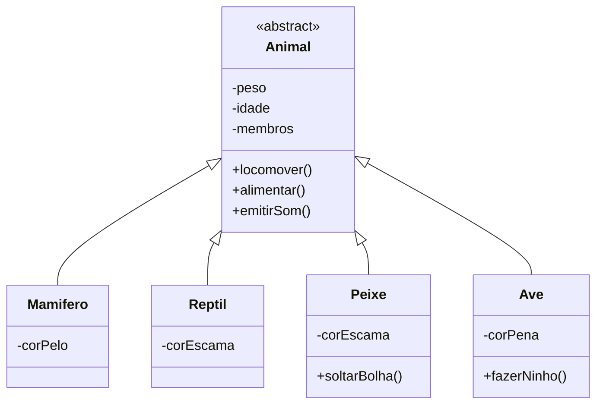

# Programação Orientada a Objetos (POO)

> **Objetivo:** Aproximar o mundo digital do mundo real.

## 🕰 Linha do Tempo da Programação

```
Programação de Baixo Nível ➝ Linear ➝ Estruturada ➝ Modular ➝ Orientada a Objetos
```

---

## ✅ Vantagens da POO

- **Confiável:** Isolamento entre partes aumenta a segurança. Mudanças locais não afetam o sistema inteiro.
- **Oportuna:** Divisão em partes permite desenvolvimento paralelo.
- **Manutenível:** Atualizações beneficiam todos os objetos que usam a classe modificada.
- **Extensível:** Permite evolução contínua do software.
- **Reutilizável:** Objetos podem ser reaproveitados em outros sistemas.
- **Natural:** Mais próxima da forma como pensamos no mundo real.

---

## 🧱 Conceitos Fundamentais

### Objeto

> Qualquer coisa (real ou abstrata) com características, comportamentos e estado.

Exemplo: `Caneta`

- **Atributos:** modelo, cor, ponta, carga, tampada
- **Métodos:** escrever, desenhar, tampar, destampar
- **Estado:** tampada, azul, 90% de carga

### Classe

> Molde ou estrutura que define os atributos e comportamentos de um objeto.

```pseudo
Classe Caneta
  modelo: Caractere
  cor: Caractere
  ponta: Real
  carga: Inteiro
  tampada: Lógico

  Método rabiscar()
    Se (tampada) então
      Escreva("ERRO")
    senão
      Escreva("Rabisco")
  FimMetodo
FimClasse
```

## 🧬 Instanciação

> Criar um objeto a partir de uma classe.

```pseudo
c1 = nova Caneta
c1.cor = "Azul"
c1.rabiscar()
```

## 🔐 Visibilidade

### Modificadores de Acesso

- `+` **public:** acesso global
- `-` **private:** acesso apenas pela própria classe
- `#` **protected:** acesso pela classe e suas herdeiras (subclasses)

```pseudo
Classe Caneta
  público modelo
  privado ponta
  protegido carga
FimClasse
```

## 🔧 Métodos Especiais

### Getters e Setters

> Controlam acesso e modificação de atributos privados.

```pseudo
public Metodo getModelo()
  return modelo
FimMetodo

public Metodo setModelo(m)
  modelo = m
FimMetodo
```

### Construtores

> Inicializam objetos com valores padrão.

```pseudo
Metodo Construtor(m, c, p)
  setModelo(m)
  setCor(c)
  setPonta(p)
  tampar()
FimMetodo
```

## 🧱 Pilares da POO

### 1. Encapsulamento

- Oculta detalhes internos da implementação.
- Fornece **interfaces públicas** para interação com o objeto.

### 2. Herança

- Uma nova classe herda atributos e métodos de outra.
- Permite **reutilização** e **especialização** de código.

```plaintext
Pessoa ➝ Aluno, Professor, Funcionário
```

### 3. Polimorfismo

- Objetos podem assumir várias formas.
- Um mesmo método pode se comportar de formas diferentes dependendo do objeto.

## 🔌 Interface

> Lista de métodos (sem implementação) que uma classe deve seguir.

```pseudo
interface Controlador
  Método ligar()
  Método desligar()
  ...
FimInterface
```

```pseudo
Classe ControleRemoto implementa Controlador
  Método ligar()
    setLigado(true)
  ...
FimClasse
```

## 🧬 Herança em Detalhe

- **Herança de Implementação:** herda sem adicionar novos métodos.
- **Herança por Diferença:** herda e implementa métodos próprios.
- **Classe Abstrata:** não pode ser instanciada.
- **Método Abstrato:** declarado mas não implementado.
- **Classe Final:** não pode ser herdada.
- **Método Final:** não pode ser sobrescrito.


## 🐙 Polimorfismo



